# Моделирование агрегации, ограниченной диффузией (DLA)

Дипломный проект: симуляция роста фрактальных кластеров методом Diffusion-Limited Aggregation. Частицы совершают случайное блуждание по области и прилипают к кластеру при столкновении. Реализовано 4 типа симуляции с разными начальными условиями и правилами движения частиц, всё считается и отрисовывается в реальном времени.

**Стек:** Python, Pygame, asyncio 

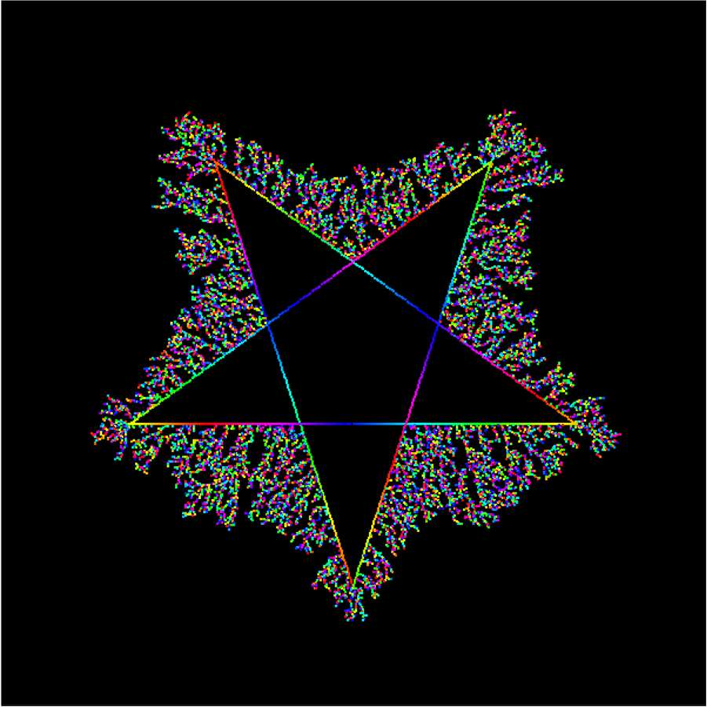

## Четыре типа симуляции

Каждый тип показан в двух режимах отрисовки: на белом фоне видна структура кластера, на чёрном цвет кодирует порядок прилипания частиц — от красного (первые) к фиолетовому, то есть видна хронология роста, а не только финальная форма.

### Тип 1 — классический рост

Зерно в центре, частицы блуждают по всей области и прилипают к растущему кластеру. Каноничная радиально-симметричная фрактальная структура.

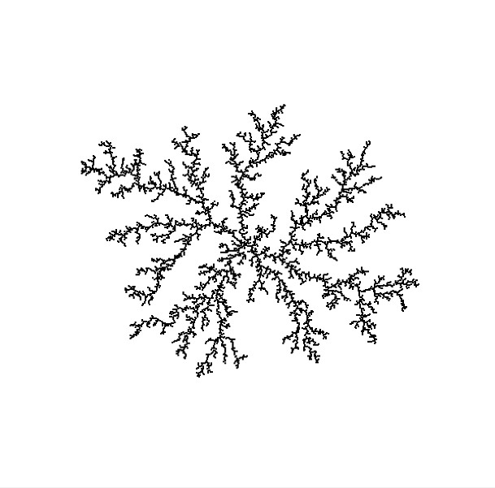 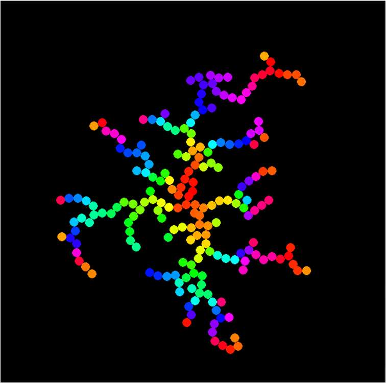

### Тип 2 — броуновские деревья

Зёрна расставлены по нижней границе, частицы запускаются сверху и движутся со смещением вниз, имитируя гравитацию. Направленное движение даёт анизотропные структуры — вытянутые вверх деревья с ветвями.

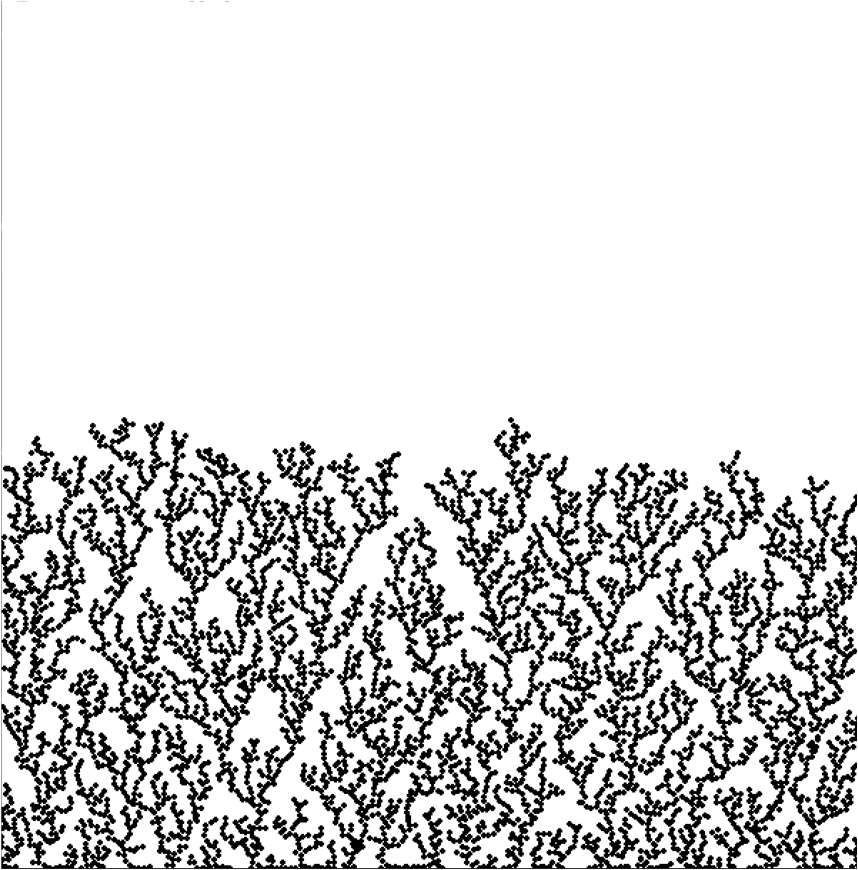 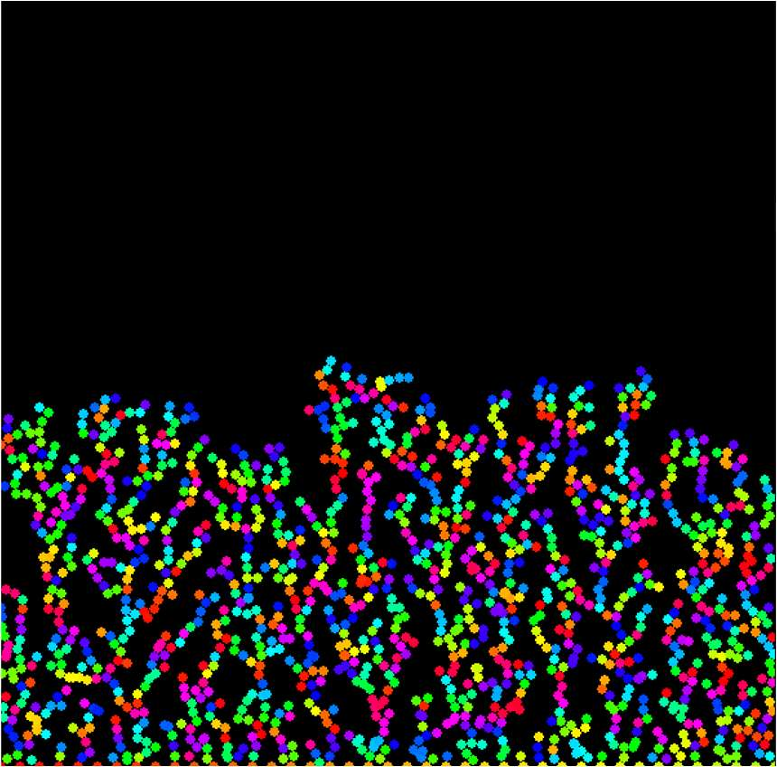

### Тип 3 — рост со всех сторон

Зёрна по всему периметру области, частицы стартуют из случайных точек внутри. Отсутствие смещения даёт изотропный рост и симметричную сетчатую структуру.

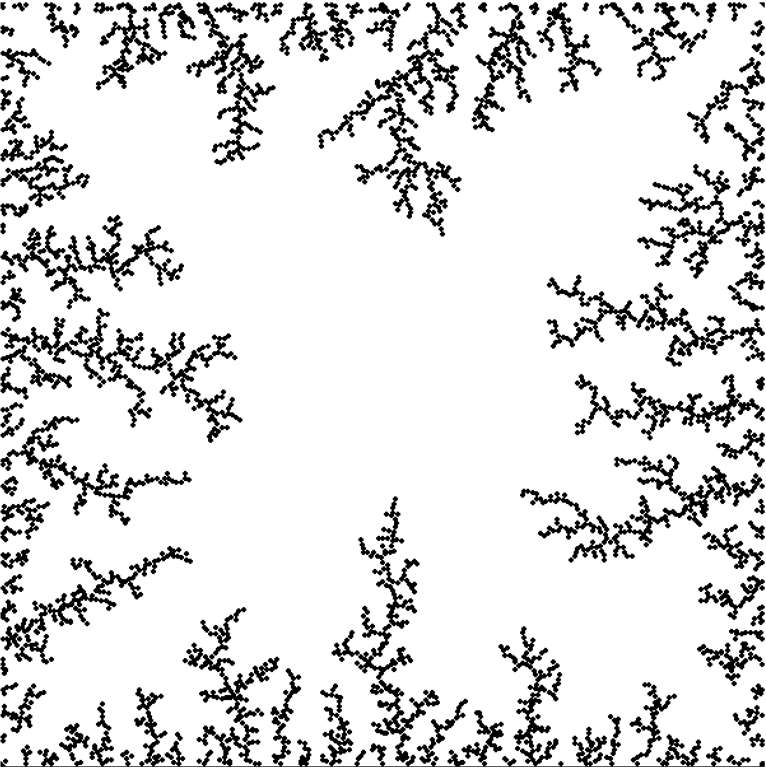 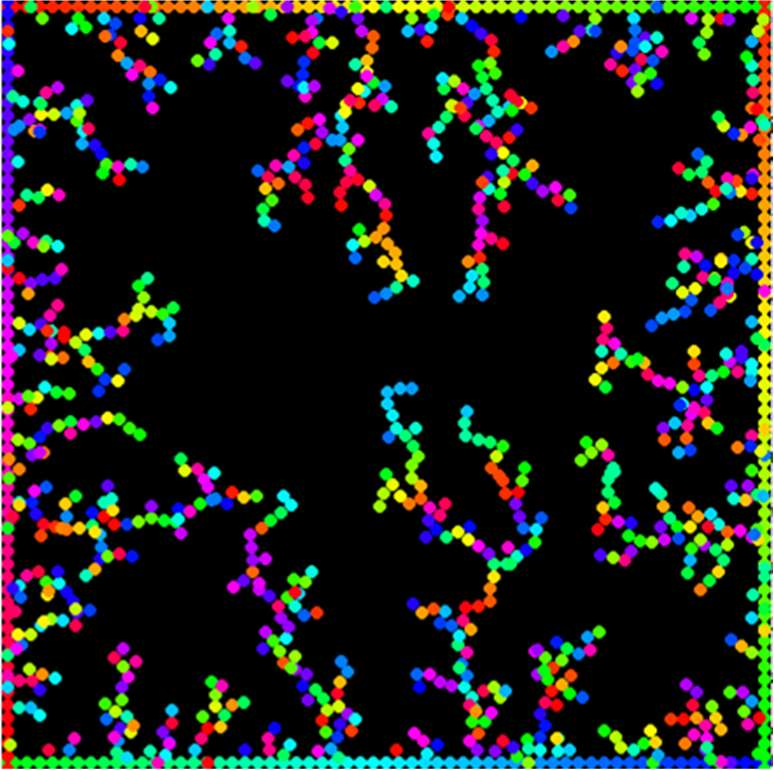

### Тип 4 — рост на поверхности фигуры

Начальные зёрна образуют контур пятиконечной звезды, частицы запускаются с границ экрана и дрейфуют к центру. Ветви наследуют геометрию исходной фигуры — структура сочетает симметрию звезды с хаотичностью DLA.

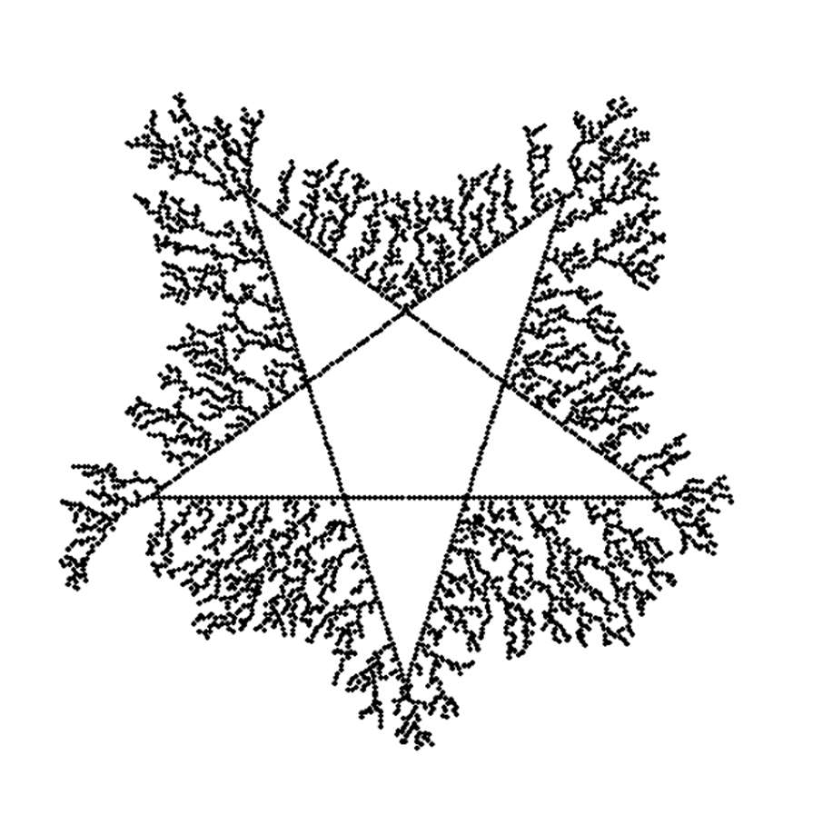 

## Форма частиц

Для первого типа форма частицы настраивается: круг, квадрат, треугольник или случайный микс. Форма влияет на плотность упаковки и характер ветвления.

| Круг | Квадрат | Треугольник | Микс |
|---|---|---|---|
| 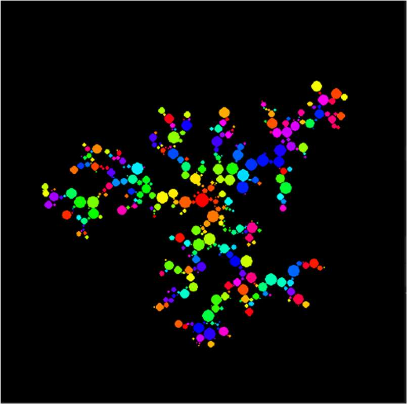 | 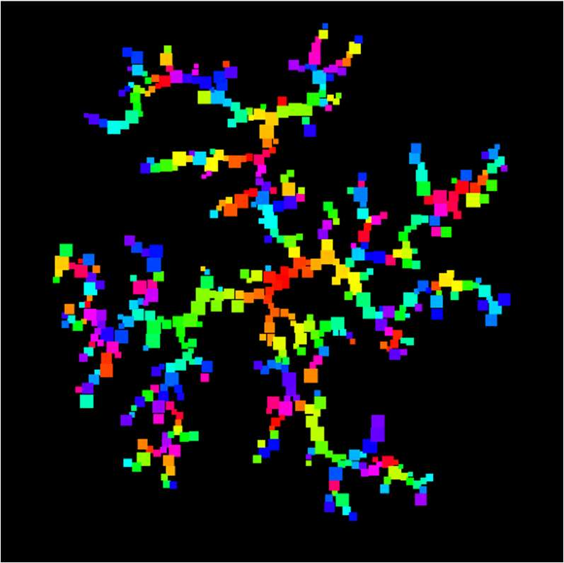 | 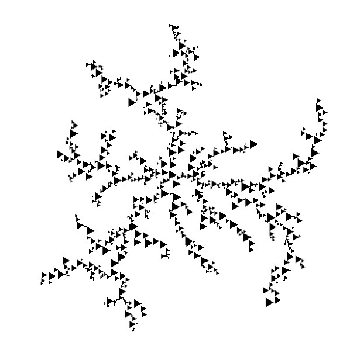 | 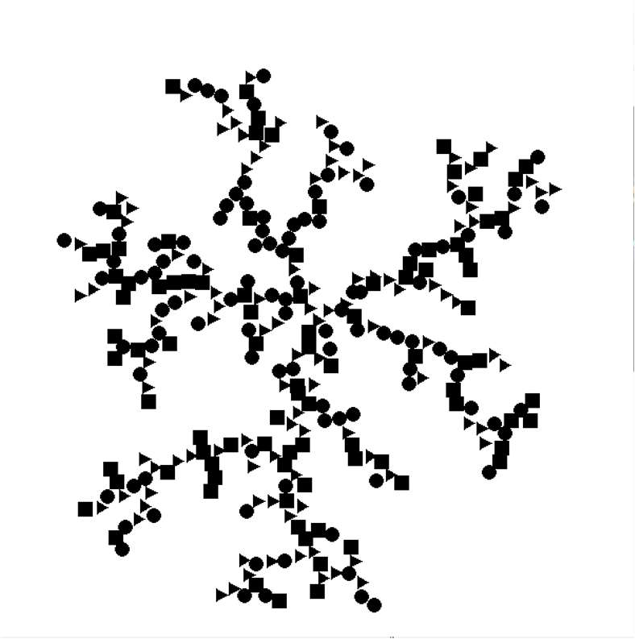 |

## Технические решения

**Пространственное хеширование вместо полного перебора.** Наивная проверка столкновений сравнивает каждую движущуюся частицу со всеми частицами кластера — это O(n), и при тысячах прилипших частиц симуляция встаёт. Пространство разбито на сетку с ячейкой размером `2 * radius` (`defaultdict(list)`), частица проверяется только с содержимым своей ячейки и 8 соседних (3×3). Сложность падает до O(k), где k — число частиц в окрестности, что позволило держать реальное время на тысячах частиц.

**Проверка расстояния без извлечения корня.** Во внутреннем цикле сравниваются квадраты расстояний: `dx*dx + dy*dy < (2*radius)²`. Порог считается один раз на старте (`Walker.threshold`), из горячего цикла убран `sqrt`.

**Условие прилипания:** (x − x_c)² + (y − y_c)² < (r + r_c)².

**Дрейф к фигуре (тип 4).** Контур звезды строится по вершинам, точки интерполируются вдоль рёбер для равномерного распределения зёрен. К случайному шагу частицы добавляется вектор дрейфа к центру, нормированный на расстояние: слишком большой `drift_speed` приводит к мгновенному прилипанию на подлёте, слишком малый — к хаотичному росту, не связанному с формой.

**Градиент цвета по порядку прилипания.** Оттенок берётся из HSV (`colorsys.hsv_to_rgb`) и инкрементируется на каждую прилипшую частицу.

## Параметры

Настраиваются перед запуском: число движущихся частиц (`max_active_walkers`), целевое число прилипших (`desired_total_stuck`), радиус частиц, число итераций за кадр, шаг между начальными зёрнами (`seed_spacing`), скорость дрейфа (`drift_speed`), форма частиц, коэффициент уменьшения радиуса (`shrink`), цвет фона.

Изменение параметров напрямую влияет на морфологию: больше частиц и меньше радиус — более детализированная и разреженная структура; меньше `seed_spacing` — больше точек роста и более плотная сетка ветвей.

## Материалы

- [Презентация](Харламов_21К1106.pdf) — метод, все четыре типа симуляции, результаты
